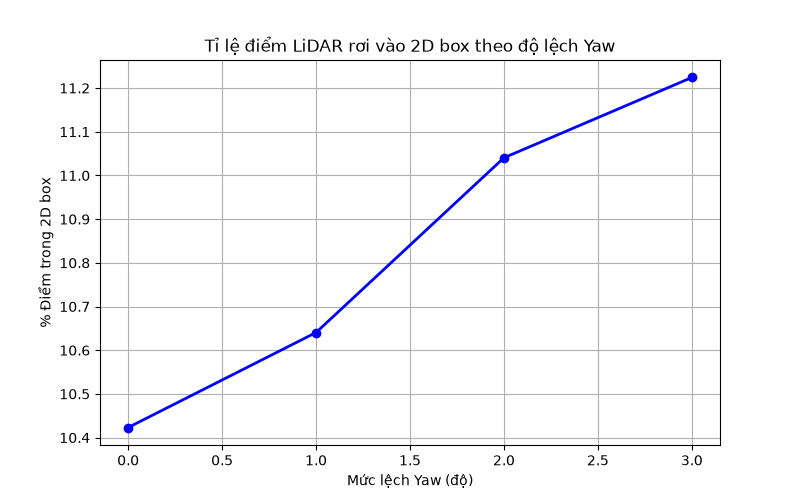
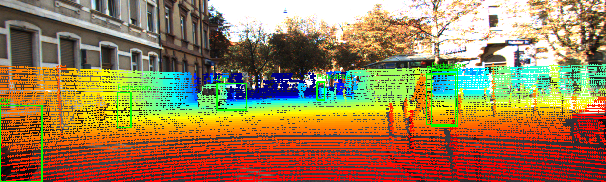

# Báo cáo Day 6: LiDAR-camera projection QA

> Thay **mọi** ô có chữ ĐIỀN nằm trong ngoặc vuông bằng nội dung của bạn, xoá luôn cả dấu ngoặc vuông. Lệnh `python tools/check_submission.py` sẽ báo FAIL nếu còn sót bất kỳ chỗ nào.

- **Họ tên:** Trần Công Thiện
- **MSSV:** 2A202602579
- **Lớp:** K4-Track4
- **Link repo:** https://github.com/TranCongThien/TranCongThien-2A202602579-Track4-Day21
- **Topic:** A — LiDAR-camera projection QA
- **Dataset:** data/kitti_mini, data/synthetic
- **Các frame đã dùng:** 000000, 000011

> Hãy viết ngắn: mỗi mục từ 3 đến 8 dòng, ưu tiên số liệu và hình ảnh.

## 1. Claim

Lệch góc yaw của LiDAR so với camera từ 1° trở lên sẽ làm chiếu sai lệch các điểm LiDAR 3D lên ảnh 2D, khiến số lượng điểm rơi vào trong 2D bounding box thay đổi bất thường (tăng lên do chiếu nhầm nền vào vật thể) và quan sát bằng mắt thường thấy rõ sự không khớp viền (edge mismatch).

## 2. Evidence

File dữ liệu: `results/yaw_perturb_sweep.csv`

| Mức lệch Yaw (độ) | Số điểm trong FOV | % Điểm trong FOV | % Điểm trong 2D Box | Ghi chú |
|---|---|---|---|---|
| 0.0 | 19946 | 18.47% | 10.42% | Calibration chuẩn, điểm khớp khít với vật thể |
| 1.0 | 19952 | 18.47% | 10.64% | Bắt đầu lệch nhẹ |
| 2.0 | 19963 | 18.48% | 11.04% | Lệch rõ rệt, điểm nền bắt đầu lấn vào box |
| 3.0 | 19948 | 18.47% | 11.22% | Sai lệch hoàn toàn, viền xe bị trượt ra ngoài đám mây điểm |




## 3. Failure case

Nêu khi nào hệ thống hoặc phương pháp fail, vì sao fail, và liên hệ tới lớp nào trong 6 lớp debug: I/O, Geometry, Time, Preprocess, Model, Metric.



Hệ thống projection fail (cho kết quả sai lệch hoàn toàn) khi calibration bị lệch góc yaw 3 độ.
Nguyên nhân: Ma trận Extrinsic chuyển đổi từ LiDAR sang Camera bị sai góc xoay, dẫn đến toạ độ 3D khi nhân với ma trận này bị tịnh tiến sang một hướng khác trên mặt phẳng ảnh 2D. 
Lớp debug: **Geometry**. Phép toán biến đổi hệ toạ độ (rigid transform) không còn phản ánh đúng vị trí vật lý thực tế giữa hai cảm biến.

## 4. Khuyến nghị nếu triển khai thật

Use-case cụ thể (ADAS / robot / drone), trade-off và bước tiếp theo.

Đối với hệ thống ADAS trên xe tự hành, việc lệch calibration do rung lắc hoặc va chạm nhẹ là rất phổ biến. Khuyến nghị: Cần chạy background một thuật toán tự động đo độ khớp (alignment score) giữa viền của điểm LiDAR (depth edges) và viền ảnh camera (image edges). Nếu điểm số này giảm xuống dưới một ngưỡng, hệ thống phải phát cảnh báo "Cần hiệu chỉnh lại cảm biến" để đảm bảo an toàn. Trade-off: tốn thêm tài nguyên tính toán liên tục để giám sát sức khoẻ cảm biến.

## 5. Cách chạy lại

Các lệnh tái tạo lại toàn bộ kết quả từ repo sạch.

```bash
python -m venv .venv
source .venv/bin/activate
pip install -r requirements.txt
python -m src.experiment
```

## 6. Khai báo sử dụng AI

Ghi rõ đã dùng công cụ AI nào, dùng vào việc gì, và bạn đã tự kiểm chứng kết quả đó bằng cách nào. Nếu không dùng AI, ghi "Không sử dụng". Xem quy định ở `RULES.md` mục 2.

| Công cụ | Dùng cho việc gì | Bạn đã kiểm chứng thế nào |
|---|---|---|
| Gemini 3.1 Pro (Antigravity IDE) | Gợi ý code projection, tính toán toạ độ đồng nhất, viết kịch bản plot matplotlib | Tự kiểm tra lại bằng print shape ma trận, check logic phép chiếu pinhole và confirm qua hình ảnh output trực quan xem điểm có nằm đúng trên xe không |
